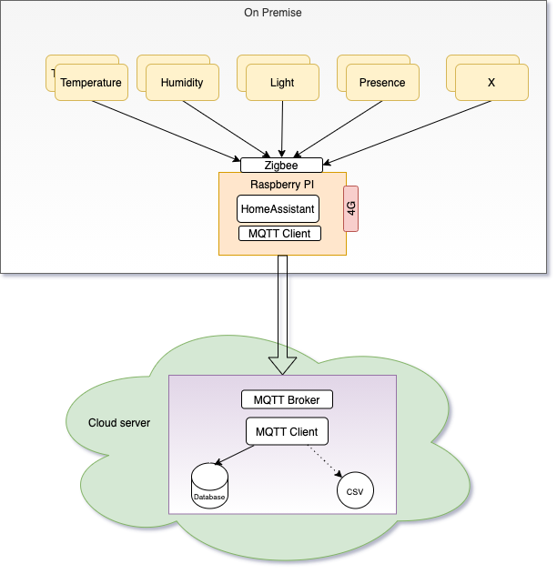

# Designforslag

Her er prinsippskissa jeg jobber etter p.t (May 2021).

## Valg som er gjort

Jeg har tatt noen valg om å benytte følgende:

- Raspberry PI (R-PI) med HomeAssistant installert.
- Zigbee protokoll
- Benytte MQTT for overføring av data mellom Raspberry pi og skyserver
- MQTT broker ligger på en skyserver
  - Fordelen er at:
    - jeg kan benytte samme MQTT broker til test oppsettet hjemme
    - Jeg får tilgang til data fra "hytta" uten å være på stedet.
- Vurderer å sette inn et 4G-kort i R-PI, som backup for opplasting til nettverk.

## Valg som må gjøres

- Hvordan skal jeg lagre dataene som lastes opp?
  - Relativt enkelt å lagre dataene som JSON i en NoSQL DB. Slipper å tenke på database-modell
- Hva og hvordan skal dataene benyttes.